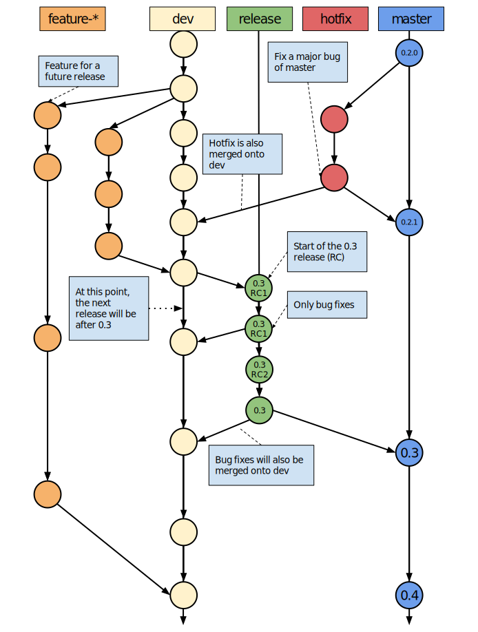

* This will become a table of contents (this text will be scraped).
{:toc}

# Contributing to Lugdunum

## Branching strategy

In order to have an efficient workflow, we chose to create different branches, each with its own responsability:

-   `master`: the *master* branch points to the latest stable release of the 3D engine. It is protected, which means that only trusted contributors can accept a pull-request to this branch. This branch guaranteed (up to a certain level) to be stable, and this is the only branch officially supported.
-   `hotfix`: this branch is dedicated to urgent bug fixes of the *master* branch. Emergency fixes will be commited to this branch directly, and a pull-request will be opened to allow a really quick code-review before pushing the changeset to *master*.
-   `release`: this branch contains changes that one day will reside on *master*. They are present to allow users to test out new functionnality before it is officially supported and bug-free.
-   `dev`: this is the unstable, working branch. Changes on this branch may not be quite stable yet, and they might not work correctly on every platform. Once *dev* is sufficiantly stable, it will be merged onto *release* (or cherry-picked).
-   `feature-*`: these branches are feature branches, usually used by one or more developers working on a new feature. Pull-requests from these branch must be opened onto *dev* only.

An example is show in [here](#fig:branching-strategy), to demonstrate the utility of each branch, with a real-world scenario.
This branching strategy is applicable across all Lugdunum's projects and must be respected. As such, the branches `master` and `dev` are *protected* on Github, which means that only administrators have push access to these branches, and that pull-requests with complete, passing tests must be opened in order to have changes implemented in these branches.

<figure id="fig:branching-strategy">
  
  <figcaption class="caption">Brancing strategy</figcaption>
</figure>

# Testing architecture

Each commit pushed on each branch is compiled and tested by [CircleCI](https://circleci.com/gh/Lugdunum3D/Lugdunum) and [AppVeyor](https://ci.appveyor.com/project/Lugdunum/lugdunum).

You are encouraged to write tests for your code. Broken build will not be allowed in any case in a pull-request, so be careful!

## Introduction

All our sensible code is covered by unit tests. We use the [Google-Test](https://github.com/google/googletest/tree/master/googletest) framework which is considered as a third party module of our project. It is bound with [Google-Mock](https://github.com/google/googletest/tree/master/googlemock).

All the written tests can be found in the test folder of the [Lugdunum's repository](https://github.com/Lugdunum3D/Lugdunum/tree/dev/test) in the `dev` branch.

All the tests included in the folder `test` are executed when you run the tests with cmake, and are executed as well in CircleCI.

## How to add new tests

If you want to add your tests, we recommend you to create a new folder in the `test` folder and put all your `*.cpp` in it. The structure of a test file should be like following :

``` cpp
#include <gtest/gtest.h>

TEST(myTestPool, myTest) {
    bool toto = true;
    EXPECT_EQ(toto, true);
}
```

To be compiled with other tests, each tests directory should have a CMakelists.txt. In a `Math` directory, this file will have the following format:

``` md
# Tests directory path
set(SRC_ROOT ${PROJECT_SOURCE_DIR}/Math)

# Define *.cpp tests
set(SRC
    ${SRC_ROOT}/Geometry/Transform.cpp
    ${SRC_ROOT}/Matrix2x2.cpp
    ${SRC_ROOT}/Matrix3x3.cpp
    ${SRC_ROOT}/Matrix4x4.cpp
    ${SRC_ROOT}/Quaternion.cpp
)
source_group("src" FILES ${SRC})

# Add tests to compilation
lug_add_test(Math
             SOURCES ${SRC}
             DEPENDS lug-math
)
```

**Note:** `source_group` on line 12 is a special CMake directive used for grouping source files in IDE project generation, for example groups in Visual Studio. More information is available [on the official CMake documentation](https://cmake.org/cmake/help/v3.0/command/source_group.html).

## Build tests

When using CMake, you need to add the command line argument `-DBUILD_TESTS`.
It will create one project for each test directory. In the previous example, it will create a `runMathUnitTests` project.
