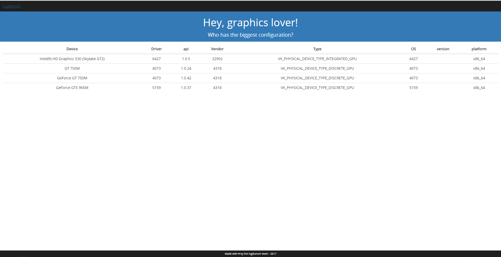

* This will become a table of contents (this text will be scraped).
{:toc}

# The LugBench Desktop Application

## Installing

In order to simplify the process of getting Lugbench, precompiled binaries are available on the [LugBench website](http://163.5.84.217/).

However depending on you operating system, you can:

###  Arch Linux

    pacaur -S lugbench

###  Android

Search and install `LugBench: Vulkan Benchmarking` on the Play Store.

## How to use

At this moment, the lugbench application only query vulkan hardware capability and send them to the server. The application doesn't start any 3D scene yet, therefore no GUI is yet to be seen from the user.

# LugBench website

## How to use

First of all, you want to open your favorite browser. Next, you can go [on our website](http://163.5.84.217/).

<figure id="front-page-lugbench">
  
  <figcaption class="caption">Front page of the LugBench website</figcaption>
</figure>

You can access the list of all the lugbench user's configurations, and sort it by any field you want.

Don't worry about the minimalist aspect of the website. For now, it is still a work in progress. If you want, feel free to open an issue to present any idea you may have about a new cool feature. We are open to any suggestion but refer to us before start developing it as we may work on it as well.
